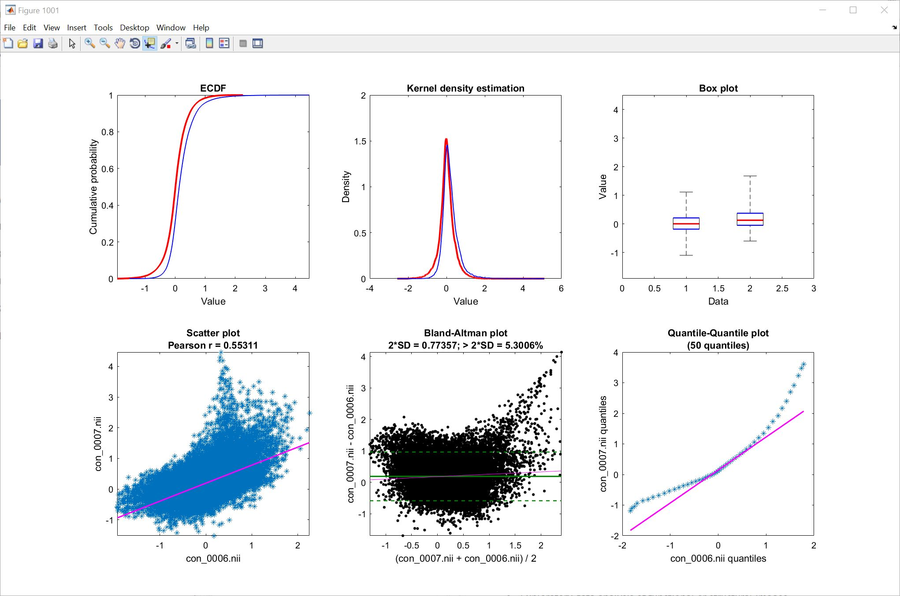

# imcalc
Batch-based image calculations and transformations for the SPM brain image analysis package (https://www.fil.ion.ucl.ac.uk/spm/).

For full information, see http://tools.robjellis.net

For documentation, see http://robjellis.net/tools/imcalc_documentation.pdf

## Sample output

